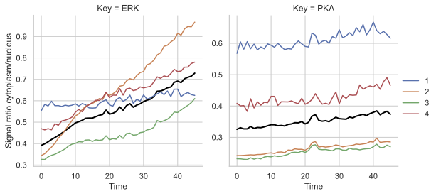

## Overview
This Python script is designed for image analysis of translocase reporters. It performs background subtraction and nucleus segmentation using thresholding. The cytoplasm is defined by dilating the nucleus into a cytoplasmic ring within multi-channel image stacks. The script then tracks individual cells over time and quantifies the intensity of both the nucleus and cytoplasm over time. The extracted data is saved in CSV/XLSX formats and visualized through various plots.


## Running the script

To run the script from the commandline follow these instructions:
- Download the raw python files from the github page and put them in a new folder. 

- In the "analyze_transl_rep.py" script, change the "sys.path.append('/Users/m.wehrens/Documents/git_repos/_UVA/2024_small-projects/2025_analyze_translocation_reporters_Julian/')" to the filepath to the folder you downloaded the script files to.

- **Make sure the functions scripts stay inside a folder called "Functions", while the analyze_transl_rep.py script should be outside the "Functions folder".**

- In your terminal, navigate to the folder where the script files are located

- In your terminal define the input_folder (where your data is located) and output_folder (where the output should go) as follows:

```bash
input_folder="/Path/to/your/input/data/"
output_folder="Path/to/your/desired/output_folder/"
auto_correct_bg=1

python analyze_transl_rep.py $input_folder $output_folder $auto_correct_bg nucleus 0 ERK 1 PKA 2
```

- `auto_correct_bg` should be 1 (=yes) or 0 (=no), indicating whether background should be corrected automatically.

- The keywords `nucleus 0 ERK 1 PKA 2` indicate that nuclear channel is 0, ERK measurement channel is 1, PKA measurement channel is 2. The keyword **'nucleus' is mandatory**, the other two channel names can be named as desired. At least one channel additional to the nuclear channel should be defined.

- CSV/xlsx files and plots (PDF) will be placed in the output folder


## Features

- Supports up to 3 channel image stacks in tiff file format

- OTSU thresholding

- Cell tracking

- Outputs segmented images with visualization (PDF), data files in csv and xlsx formats

- Command line compatible


## Credits


## Example output plot





 

